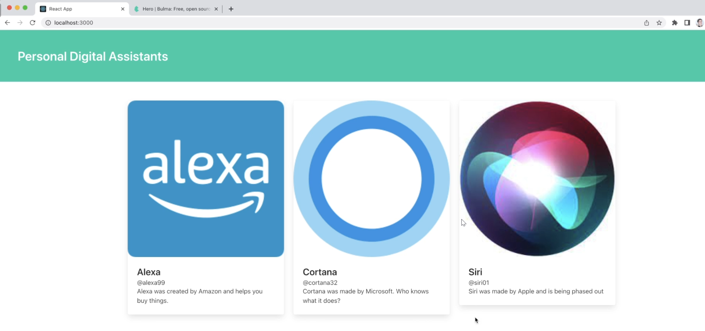

<h1>Section #3 - Building Resuable Components!!</h1>

    Welcome to Section #3 Building Resuable Components! In this section Stephen build a simple a card component
    to show you how to create a resuable component.

<h2>Mock-Up</h2>

<h2>Concepts You Will Learn</h2>
<ul>
  <li>Props and Prop Objects</li>
  <li>Destructing Objects</li>
  <li>Placing Images in your components</li>
  <li>Install NPM modules</li>  
  <li>Using CSS Library</li>
</ul>

Concepts and examples are located in the concept folders, which is in the src folder, which is inside
