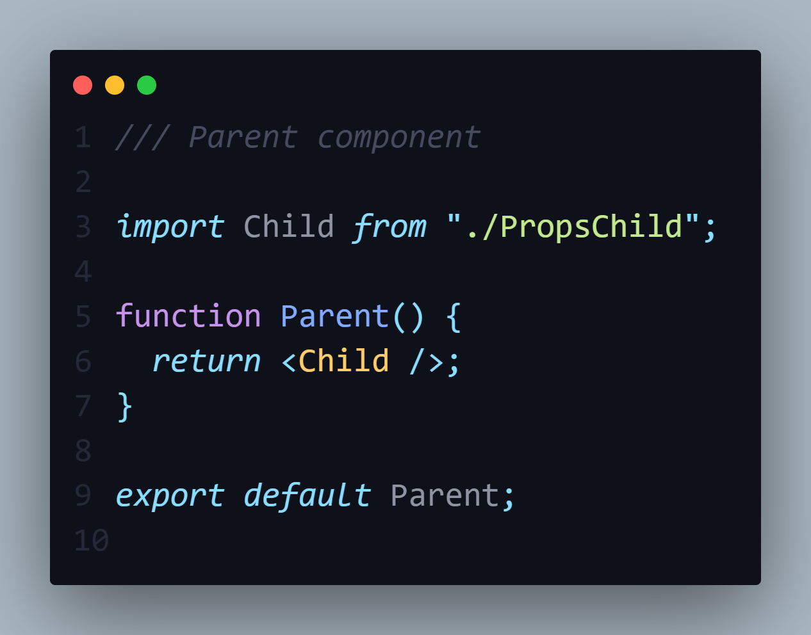
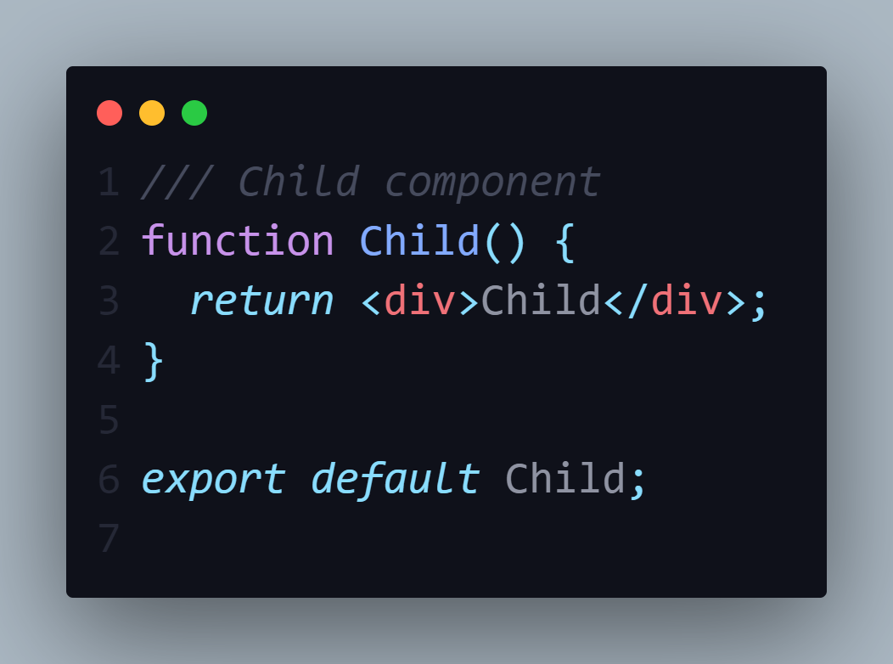
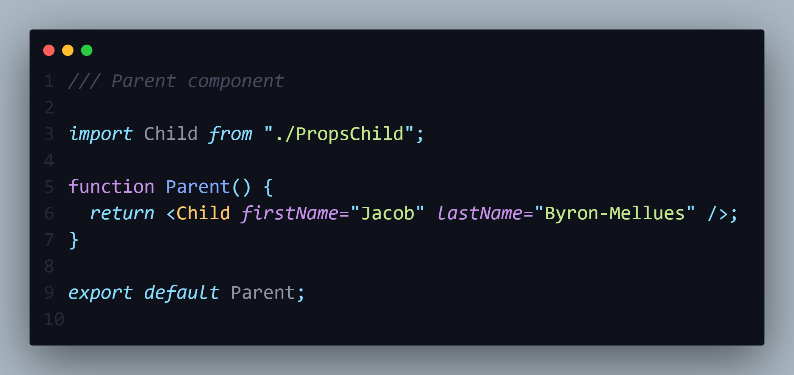
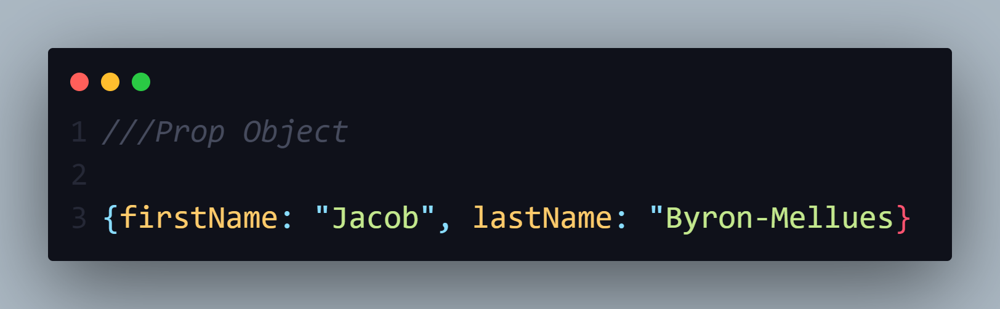
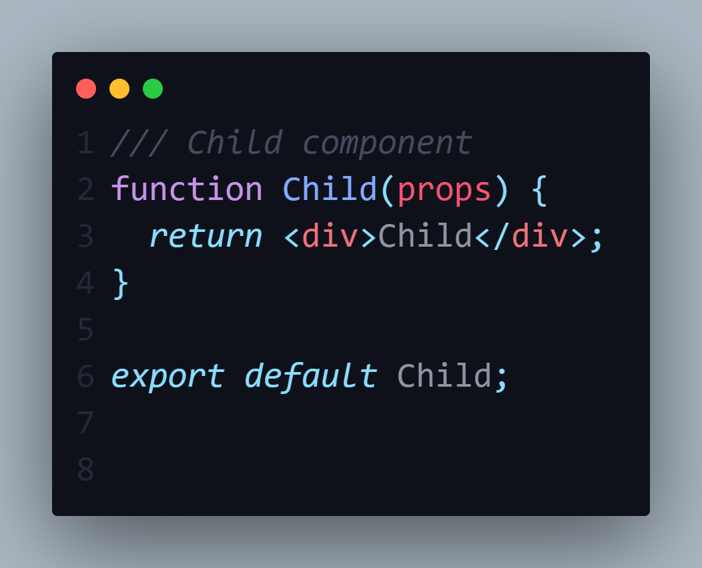
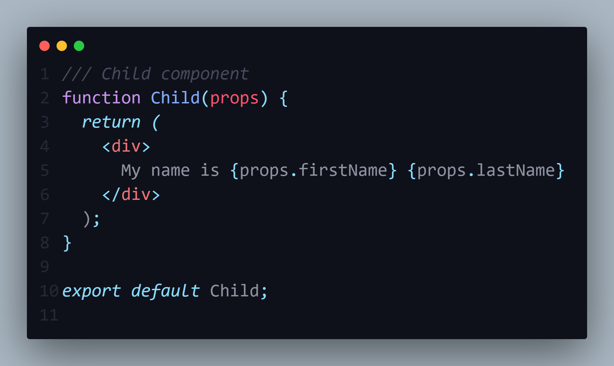

<h1>Prop System and Props Objects</h1>

<h2>What is a props?</h2>

    props are data that a parent component to passes to its child component.With this the parent component can configure each child component differently. Showing different text, images, style, etc for each child component.

<strong>
  REMEMBER: But it is one way. The parent can passed to the child components, but not the other way around.
</strong>

<h3>Example:</h3>

Here is your parent component named Parent

Here is your child component named Child

 <strong>Step 1:</strong> We give the parent component data we want to pass to as an JSX attribute.

You can name the attrribute whatever you.

 

 In the example we will pass down a first name and last name to child component, called firstName and lastName.
 The attribute values will be two string, firstName is Jacob and lastName is Byron-Mellues.

<strong>REMEMEBER TO SPELL THE ATTRIBUTE NAME CORRECTLY AND CHECK IT TWICE! We will discuss this later!</strong>

<strong>Step 2:</strong> React takes all the attributes from the parent component put into an object known as the prop object.

Each child component get its own object.

Remember how I say spell the JSX attribute correctly and check! It is because jsx attribute name will be the property name in the prop object 

<strong>Step 3:</strong> Props object will be the first argument of the child component.

You can name it whatever but the convention is to name it props

<strong>Step 4:</strong> To use the properties in the props object use the curly brace and inside it use the dot notation to access whatever property you want to use in the object

In the example we are using both the firstName and lastName properties.

<strong>REMEMEBER TO SPELL THE ATTRIBUTE NAME AND PROP NAME CORRECTLY AND CHECK IT TWICE OR NO VALUE WILL SHOW ON THE BROWSER because it is undefined!</strong>

<h2>CONFUSION POINT!</h2>

I was confused about the props used for HMTL tags and props used for react component tags.

Remember that HTML tags props are HTML attributes and react component tags props are custom attributes you create.

Ex.

HTML ---> <input type="checkbox">

Component ---> <MyName name="John" />
